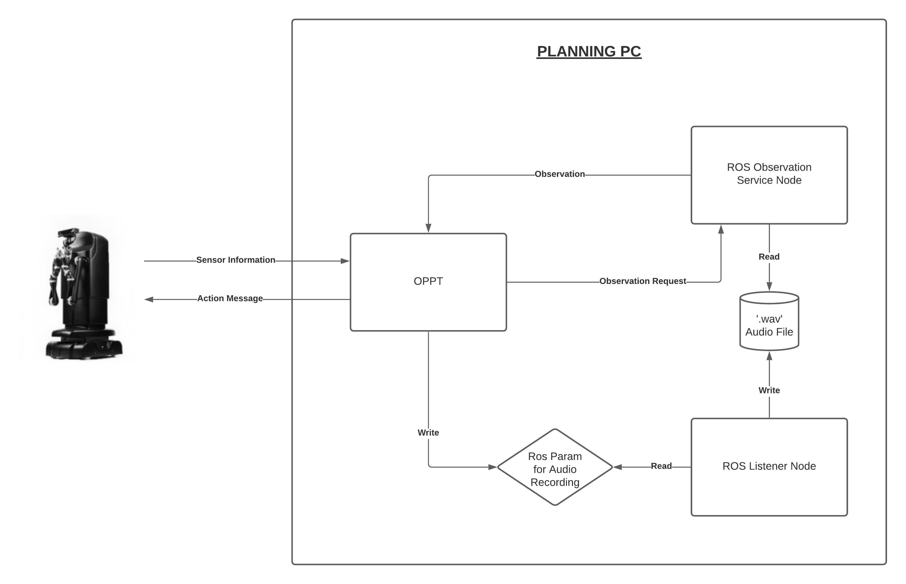

# AudioClassification

Clone the repo into a desired location. In this example we will use the local Desktop and install the module. 
## Installation:
    cd ~/Desktop
    git clone https://github.com/hoergems/AudioClassification.git
    mkdir Observation && cd Observation
    mkdir src
    ln -s ~/Desktop/AudioClassification/ObservationService ~/Desktop/Observation/src
    catkin_make
    cd ~/Desktop
    cd AudioClassification && mkdir build && cd build
    source ~/Desktop/Observation/devel/setup.bash
    cmake -DCMAKE_INSTALL_PREFIX=<install folder> -DUSE_ARM_HACK=ON ..
    make && make install

## Usage
On the MOVO2 computer, open a terminal and run

    movostop

Then run

    roslaunch movo_bringup_simple main.launch

On your computer, open 3 terminal windows. On the first window run the following commands : 

    source <install folder>/share/oppt/setup.sh
    source ~/Desktop/ObservationService/devel/setup.bash
    cd <oppt folder>/bin
    ./abt --cfg <folder where this repo is cloned into>/cfg/AudioClassification.cfg

On the second window run the following commands : 

    source <install folder>/share/oppt/setup.sh
    source ~/Desktop/ObservationService/devel/setup.bash
    rosrun ObservationService serviceNode.py

On the third window run the following commands : 

    source <install folder>/share/oppt/setup.sh
    source ~/Desktop/ObservationService/devel/setup.bash
    rosrun ObservationService listener.py

